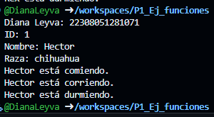

crear una clase animal con los aributos (id_animal, nombre y raza) y una funcion comer(). crea otra clase perro con herencia animal con las funciones correr() y otra dormir(). en lenguaje dart

salida de resultados

