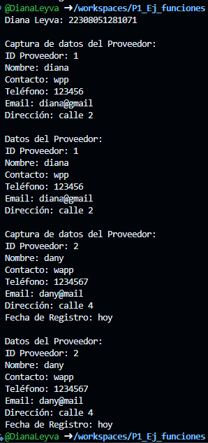

crear la clase proveedores con los atributos (id_proveedor nombre contacto telefono email direccion) mas una funcion capturadatos(), con interaccion de interfaz de usuario, 
crear la clase clientes(id_cliente nombre email telefono direccion fecha_registro) con herencia  proveedores y una funcion mostrardatos() en lenguaje dart

